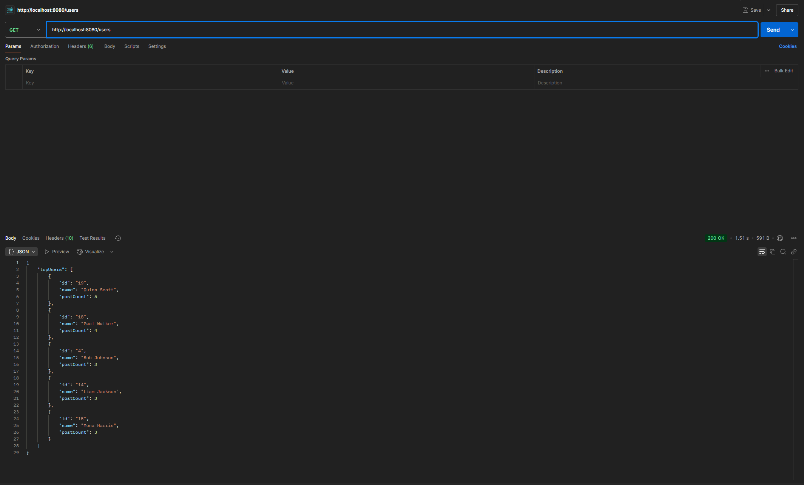

# Full Stack Social Posts Application

A modern full-stack application for managing user posts with features to display popular and latest posts.

## Features

### 1. Popular Posts
View posts sorted by popularity (comment count)


### 2. Latest Posts
View the most recent posts


### 3. Top Users
View users ranked by their post count


## Tech Stack

### Frontend
- React 19
- TypeScript
- Vite
- TailwindCSS
- Lucide React (for icons)

### Backend
- Express.js
- TypeScript
- Cors
- Axios
- Dotenv

## Project Structure

```
├── frontend/                # Frontend React application
│   ├── src/
│   │   ├── actions/        # API interaction functions
│   │   ├── types/          # TypeScript interfaces
│   │   └── ...
│   └── package.json
└── backend/                # Backend Express application
    ├── src/
    │   ├── controllers/    # Request handlers
    │   ├── routes/        # API routes
    │   ├── types/         # TypeScript interfaces
    │   └── index.ts       # Entry point
    └── package.json
```

## API Endpoints

- `GET /users`: Fetch top users
- `GET /posts?type=popular`: Fetch popular posts sorted by comment count
- `GET /posts?type=latest`: Fetch latest 5 posts

## Getting Started

### Backend Setup
```bash
cd backend
npm install
npm run dev    # For development
npm run build  # For production build
npm start      # To start production server
```

### Frontend Setup
```bash
cd frontend
npm install
npm run dev    # Starts development server on port 3000
npm run build  # For production build
```

## Type System

The application uses TypeScript throughout with shared types between frontend and backend:

- User management (User, TopUser)
- Post management (Post, ExtendedPosts)
- Comment system (Comment)
- API responses (Various response interfaces)

## Development

- Backend runs on port 8080
- Frontend development server runs on port 3000
- Uses environment variables for configuration
- Full TypeScript support with strict type checking
